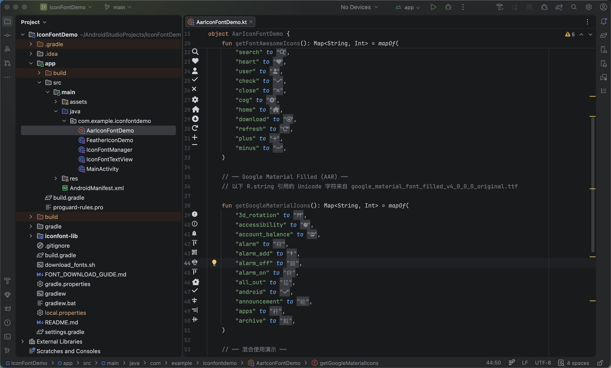
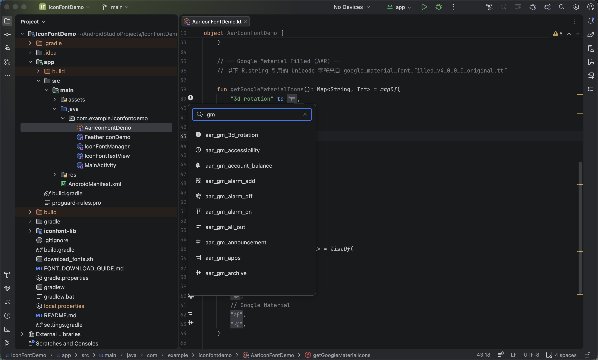
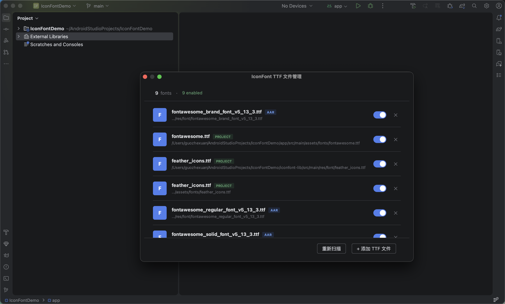

# IconFontViewer

 

Android Studio 插件 — 在编辑器 gutter 中预览 iconfont 图标。

## 功能

- **Gutter 预览** — Kotlin/Java 中的 `R.string.xxx`、XML 中的 `@string/xxx`、strings.xml 中的 `<string>` 定义，均可在行号旁直接看到图标
- **点击替换** — 点击 gutter 图标，浏览该字体所有可用图标并一键替换
- **智能扫描** — 启动时自动扫描项目和 AAR 依赖中的 TTF 字体文件
- **字体管理** — 通过 Tools → IconFontViewer 管理字体的启用/禁用、手动添加和删除

## 截图

### Gutter 图标预览

### 图标搜索与替换

### 字体管理面板

## 安装

**方式一：Marketplace（推荐）**

Settings → Plugins → Marketplace → 搜索 "IconFontViewer" → Install

**方式二：本地安装**

1. 下载 `IconFontViewer-1.0.0.zip`
2. Settings → Plugins → ⚙️ → Install Plugin from Disk → 选择 zip 文件
3. 重启 Android Studio

## 使用

1. 项目中准备好 iconfont TTF 文件（放在 `assets/` 或 `res/font/` 下，或通过 AAR 依赖引入）
2. 在 `strings.xml` 中定义图标资源：`<string name="icon_home">&#xE88A;</string>`
3. 在代码中引用 `R.string.icon_home`，gutter 处自动显示图标预览
4. 通过 Tools → IconFontViewer 管理字体列表

## 兼容性

| 项目 | 要求 |
|------|------|
| Android Studio | 2024.1 (Koala) 及以上所有版本 |
| 字体格式 | TrueType (.ttf) |
| 字符编码 | `&#xHHHH;`、`&#DDDD;`、`\uHHHH`、原始 Unicode 字符 |

## 工作原理

## 测试项目

[IconFontDemo](https://github.com/ultimateHandsomeBoy666/IconFontDemo)

## License

Apache 2.0
